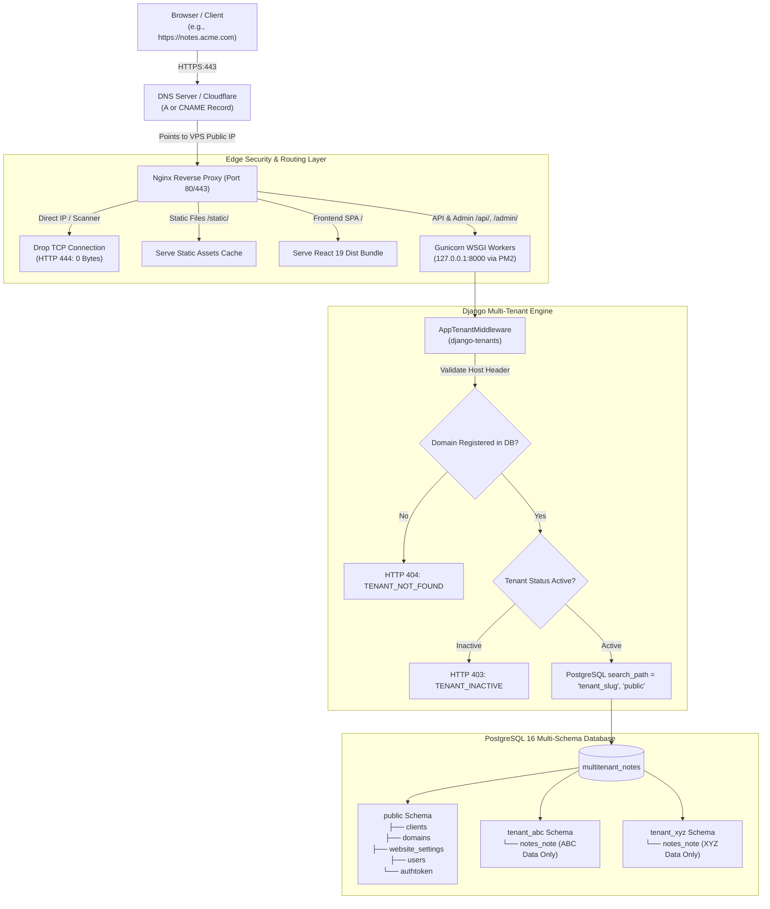
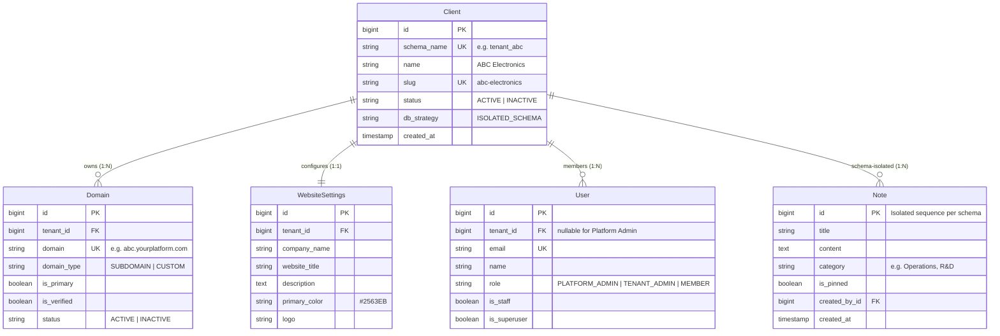
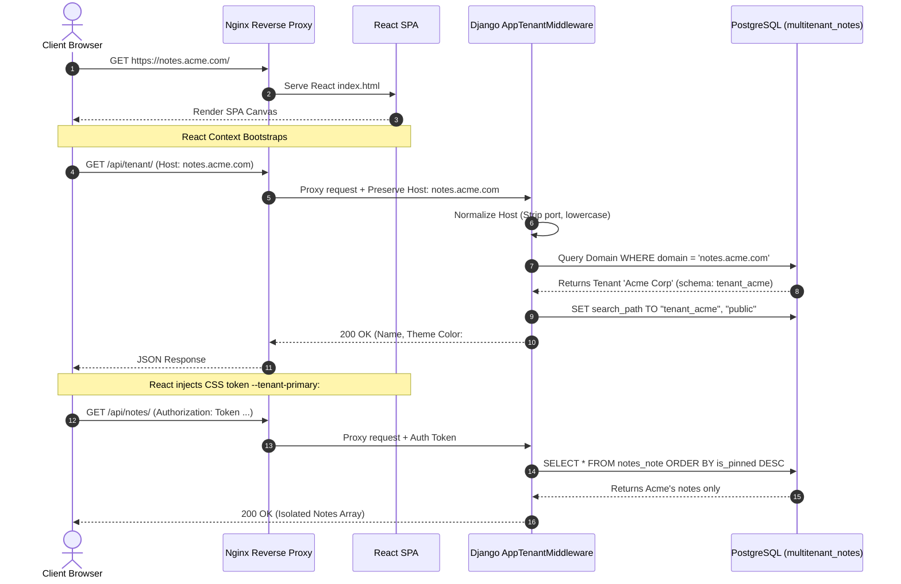
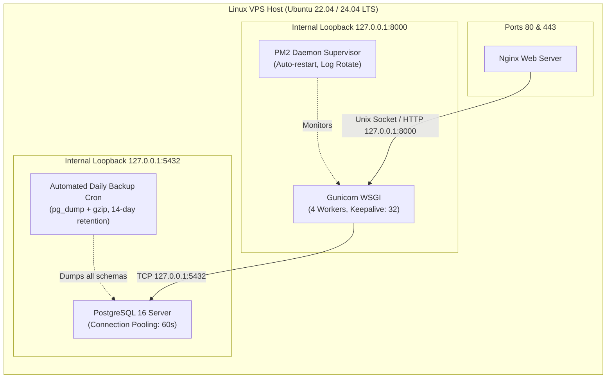

# Multi-Tenant Note Taker — Enterprise Architecture Manual

Comprehensive architectural specification for the Multi-Tenant Note Taker SaaS platform, detailing physical PostgreSQL schema isolation, dynamic domain resolution, security boundaries, and production Linux VPS topology.

---

## 1. System Topology & Architectural Blueprint



---

## 2. Multi-Tenancy Strategy: Physical Schema Isolation

### Why `django-tenants` Physical Schema Isolation?
In software-as-a-service architectures, there are three primary multi-tenancy models:

| Approach | Implementation | Isolation Level | Data Leakage Risk | Maintenance Overhead |
| :--- | :--- | :--- | :--- | :--- |
| **Shared Database, Shared Tables** | `WHERE tenant_id = ?` column | Low (Application-level) | **High** (Developer bug can expose all rows) | Low |
| **Schema-per-Tenant (Our Architecture)** | PostgreSQL native schemas | **High (Database kernel-level)** | **Zero** (Locked via `search_path`) | Moderate |
| **Database-per-Tenant** | Separate DB instances | Maximum | Zero | Very High (Expensive server costs) |

### PostgreSQL `search_path` Mechanics
When `AppTenantMiddleware` identifies the tenant (e.g. `ABC Electronics`), it executes:
```sql
SET search_path TO "tenant_abc", "public";
```
- Every standard query (`SELECT * FROM notes_note`) automatically resolves to `tenant_abc.notes_note`.
- Code **cannot physically read or write** rows in `tenant_xyz.notes_note`.
- Primary keys and sequence generators (`notes_note_id_seq`) are completely independent per tenant.
- A rogue client attempting to inject `tenant_id=102` in a JSON payload has zero effect because tenant identity is derived purely from the incoming domain and database schema context.

---

## 3. Schema Data Models & ERD



---

## 4. End-to-End Request Lifecycle



---

## 5. Security Boundary & Defense-in-Depth

The platform enforces a **6-Layer Defense Architecture**:

```
[Layer 1: Nginx Network Boundary]
  ├── Raw IP Access (http://198.51.100.24/) ──► Dropped immediately with HTTP 444 (0 bytes)
  └── Non-HTTP/TLS scanning ───────────────────► ssl_reject_handshake on

[Layer 2: Django Host Header Validation]
  └── AppTenantMiddleware blocks direct IP strings ──► 403 Forbidden (DIRECT_IP_ACCESS_DENIED)

[Layer 3: Dynamic Domain Existence Verification]
  └── Hostname must exist in PostgreSQL Domain table ──► 404 Not Found (TENANT_NOT_FOUND)

[Layer 4: Tenant Lifecycle State Enforcement]
  └── Inactive / Suspended tenant subscriptions ────────► 403 Forbidden (TENANT_INACTIVE)

[Layer 5: Cross-Tenant Authentication Isolation]
  └── Token Authentication enforces user.tenant == request.tenant
  └── Cross-domain token replay attacks blocked ───────► 403 Forbidden (CROSS_TENANT_LOGIN_BLOCKED)

[Layer 6: Kernel-Level PostgreSQL Schema Isolation]
  └── search_path = "tenant_<slug>", "public"
  └── Physical table separation prevents SQL injection data cross-over
```

---

## 6. Linux VPS Production Topology



---

## 7. Zero-Downtime Deployment & Maintenance Cycle

Updates are deployed using the atomic update pipeline [`deploy/scripts/deploy_update.sh`](deploy/scripts/deploy_update.sh):
1. **Code Synchronization**: Pulls clean commits from Git `origin/main`.
2. **Schema Migration**: Executes `python manage.py migrate_schemas` (automatically identifies schema diffs across all tenant schemas).
3. **Static Collection**: Runs `python manage.py collectstatic --noinput` to update Django assets.
4. **Bundle Compilation**: Vite compiles the React bundle to `frontend/dist/`.
5. **Process Hot Reload**: PM2 triggers a graceful cluster reload of Gunicorn workers (`pm2 reload ecosystem.config.cjs`) with zero dropped requests.
6. **Reverse Proxy Reload**: Nginx validates configuration (`nginx -t`) and reloads in-memory worker pools.
