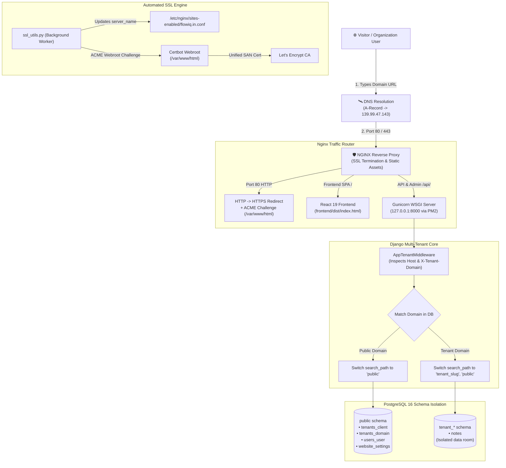

# Multi-Tenant SaaS Architecture & System Flow Guide

> **Audience:** Developers, DevOps, and Platform Engineers  
> **Platform:** FlowIQ Multi-Tenant SaaS (`https://flowiq.in`)  
> **Production Server:** Ubuntu 24.04 LTS (`139.99.47.143`)

---

## 1. The Big Picture: How It Works

Think of this platform like **Shopify**, **Slack**, or **WordPress.com**:

You only maintain **one server** and **one codebase**, but you can onboard hundreds of distinct organizations (tenants). Every tenant gets:
- Their own **dedicated domain** (`innoai.flowiq.in` or custom domain `ramakrishnavenuzia.co.in`).
- Their own **valid SSL certificate** automatically issued with zero downtime.
- Their own **custom brand identity** (theme colors, title, logo, settings).
- Their own **private database schema** so data between tenants is physically separated.

---

## 2. System Architecture Diagram



---

## 3. The 5 Core Pillars of the Platform

### Pillar 1: Domain & DNS Routing
The platform dynamically routes three different types of domain names:

| Domain Type | Example | How It Routes |
| :--- | :--- | :--- |
| **Platform Master** | `https://flowiq.in` | Resolves to the `public` schema. Serves the Platform Admin Dashboard. |
| **Tenant Subdomains** | `https://innoai.flowiq.in` | Wildcard DNS (`*.flowiq.in`) points all subdomains to the VPS automatically. |
| **Custom Domains** | `https://ramakrishnavenuzia.co.in`<br/>`https://aquamind.in` | Tenant points an **A-Record** directly to the VPS IP (`139.99.47.143`). |

---

### Pillar 2: Nginx & Reverse Proxy (The Traffic Cop)
Nginx is the public-facing entry point on the server:
- **Port 80 (HTTP)**: Automatically upgrades requests to secure HTTPS. Also serves the ACME challenge folder `/.well-known/acme-challenge/` directly from `/var/www/html` for zero-downtime SSL renewal.
- **Port 443 (HTTPS)**: Handles SSL/TLS handshakes, decrypts traffic, and enforces modern security headers (`X-Frame-Options`, `X-Content-Type-Options`).
- **Static Frontend**: Instantly serves the compiled React Single Page Application (`frontend/dist`) with client-side routing fallback.
- **Backend API**: Proxies `/api/` and `/admin/` requests to Gunicorn at `127.0.0.1:8000`, injecting the `X-Tenant-Domain` header.

---

### Pillar 3: Automated Zero-Downtime SSL Engine (The Security Guard)
Every tenant domain requires HTTPS without manual server logins. The platform achieves this via [`backend/tenants/ssl_utils.py`](file:///home/ubuntu/Multi-Tenant-Note-Taker/backend/tenants/ssl_utils.py):

1. **Trigger**: When a tenant is created, updated, or verified in the admin panel, `trigger_ssl_provisioning()` runs in the background.
2. **Nginx Synchronization**: Reads all active tenant domains and updates `server_name` in `/etc/nginx/sites-enabled/flowiq.in.conf` with elevated `sudo` privileges.
3. **DNS Validation**: Tests each custom domain with `socket.gethostbyname()`. Only domains currently pointing to `139.99.47.143` are passed to Let's Encrypt.
4. **Certbot Webroot Mode**:
   ```bash
   sudo certbot certonly --webroot -w /var/www/html \
       --non-interactive --agree-tos --register-unsafely-without-email \
       --cert-name flowiq-platform --expand -d ...
   ```
   *Why Webroot?* Webroot validates domains via static files without modifying Nginx configuration files, preventing configuration syntax errors or downtime.
5. **Nginx Reload**: Runs `sudo nginx -s reload` to load the updated certificate into memory.

---

### Pillar 4: Physical Schema Isolation (The Apartment Building)
Instead of putting all tenants into one shared table with a `tenant_id` column (which can leak data if a developer misses a `WHERE tenant_id = ?` filter), the platform uses **PostgreSQL Native Schemas** via `django-tenants`:

```
Database: multitenant_notes
├── public schema (The Building Lobby)
│   ├── tenants_client (Tenant list)
│   ├── tenants_domain (Domain mappings)
│   ├── users_user     (All users across tenants)
│   └── website_settings (Branding data)
├── tenant_aquamind schema (Apartment #7)
│   └── notes (Private notes for Aquamind)
└── tenant_rk1 schema (Apartment #8)
    └── notes (Private notes for RK1)
```

- When a request arrives, Django sets PostgreSQL's search path:
  ```sql
  SET search_path TO "tenant_rk1", "public";
  ```
- Any SQL query like `SELECT * FROM notes` automatically queries only `tenant_rk1.notes`.
- Tenant data is physically and cryptographically isolated at the database engine level.

---

### Pillar 5: Dynamic White-Label React Frontend (The Chameleon UI)
There is only one React SPA build, but it dynamically customizes its appearance based on the domain:
1. When a browser loads `https://ramakrishnavenuzia.co.in`, React sends a request to `/api/tenant/`.
2. The backend identifies the domain and returns the tenant's profile:
   ```json
   {
     "name": "rk1",
     "website_settings": {
       "website_title": "Welcome to rk1",
       "primary_color": "#2563EB",
       "description": "Official workspace and documentation portal for rk1."
     }
   }
   ```
3. React dynamically updates document titles, CSS primary colors, company logos, and login pages.

---

## 4. Lifecycle of a Request: From URL to Database

```
1. Visitor types: https://ramakrishnavenuzia.co.in/notes
   │
   ▼
2. DNS: Resolves domain to VPS IP 139.99.47.143.
   │
   ▼
3. Nginx (Port 443): Completes TLS handshake using 'flowiq-platform' SAN certificate.
   │
   ▼
4. Nginx: Serves frontend/dist/index.html to the browser.
   │
   ▼
5. React App: Boots in browser -> fires GET /api/tenant/ and GET /api/notes/.
   │
   ▼
6. Nginx: Forwards /api/... to Gunicorn at 127.0.0.1:8000 with Host: ramakrishnavenuzia.co.in.
   │
   ▼
7. Django Middleware:
   - Looks up 'ramakrishnavenuzia.co.in' in public.tenants_domain.
   - Finds Tenant #8 ('rk1', schema 'tenant_rk1').
   - Executes: SET search_path TO tenant_rk1, public;
   │
   ▼
8. Django Notes View:
   - Queries Note.objects.all().
   - PostgreSQL executes: SELECT * FROM tenant_rk1.notes.
   │
   ▼
9. Response:
   - Gunicorn sends JSON notes back to Nginx -> Nginx sends to browser.
   - React renders the notes list with rk1's custom branding.
```

---

## 5. Lifecycle of Onboarding a New Tenant

When an admin clicks **"Onboard Tenant"** at `https://flowiq.in/admin/tenants/create`:

1. **Schema Provisioning**:
   Django creates the tenant client record and automatically creates a new PostgreSQL schema (e.g., `tenant_mybrand`).
2. **Migration Execution**:
   `django-tenants` runs all tenant migrations inside `tenant_mybrand`, creating fresh `notes` tables.
3. **Administrator Account**:
   Creates the organization's initial `TENANT_ADMIN` user in the `public` schema.
4. **Domain Binding & DNS Check**:
   - Saves the domain mapping.
   - If the custom domain already resolves to `139.99.47.143`, it is immediately marked as **✓ DNS Active**.
5. **Background SSL Provisioning**:
   - Updates `server_name` in `/etc/nginx/sites-enabled/flowiq.in.conf`.
   - Certbot requests/expands the SSL certificate using `--webroot`.
   - Nginx reloads gracefully (`nginx -s reload`).
6. **Live**: The tenant workspace is ready for immediate login.

---

## 6. Technology Stack Reference

| Layer | Technology | Configuration / Location |
| :--- | :--- | :--- |
| **Operating System** | Ubuntu 24.04 LTS | Public IP: `139.99.47.143` |
| **Reverse Proxy** | Nginx | `/etc/nginx/sites-enabled/flowiq.in.conf` |
| **SSL / TLS** | Let's Encrypt (Certbot) | Webroot `/var/www/html`, Cert `/etc/letsencrypt/live/flowiq-platform/` |
| **Backend Framework** | Django 5.1 + DRF | `/home/ubuntu/Multi-Tenant-Note-Taker/backend` |
| **Multi-Tenancy** | `django-tenants` | PostgreSQL Schema-per-Tenant isolation |
| **Database** | PostgreSQL 16 | Database: `multitenant_notes`, User: `notes_user` |
| **Frontend Framework** | React 19 + Vite | `/home/ubuntu/Multi-Tenant-Note-Taker/frontend` |
| **Process Manager** | PM2 | Processes: `multitenant-backend` (Gunicorn), `multitenant-frontend` (Vite) |

---

## 7. Key Maintenance Commands

```bash
# Check running services
pm2 status

# View live backend logs
pm2 logs multitenant-backend

# Test Nginx configuration syntax
sudo nginx -t

# Reload Nginx without downtime
sudo nginx -s reload

# Check active SSL certificates
sudo certbot certificates

# Trigger manual SSL and Nginx resync via Django Shell
/home/ubuntu/Multi-Tenant-Note-Taker/backend/venv/bin/python manage.py shell -c "from tenants.ssl_utils import sync_certificates_for_domains; sync_certificates_for_domains()"
```
